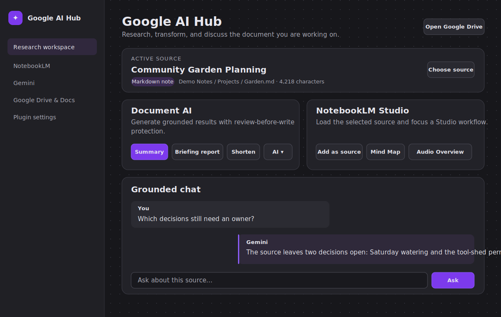

# Google AI Hub for Obsidian

Google AI Hub brings editable Google Docs tabs, Gemini document tools, grounded research, and NotebookLM Studio launchers into desktop Obsidian.



## Highlights

- Edit a Google Doc tab directly inside an Obsidian Canvas card with headings, lists, emphasis, links, quotes, and code formatting.
- Create, rename, reorder, nest, outdent, and delete native Google Docs tabs. Every open card for the document refreshes its tab strip immediately while keeping its own active tab and draft.
- Summarize, shorten, lengthen, or elaborate a selection or whole document through Gemini with an Original/Result review before anything is changed.
- Switch between quality, balanced, and fast Gemini models; discover every compatible model available to your API key or enter a custom model ID.
- Use the same AI workflow in Markdown notes, Canvas Google Doc tabs, and standalone `.gdoc` shortcuts.
- Research the active source in AI Hub with a summary, briefing report, grounded chat, and NotebookLM Studio launchers.
- Index Google Drive documents as lightweight `.gdoc` shortcuts without duplicating their contents in the vault.

## Requirements

- Desktop Obsidian 1.11.4 or newer.
- A Google Cloud desktop OAuth client with the Google Drive API and Google Docs API enabled.
- A Gemini API key for direct document AI. Availability, quota, and billing depend on the Google account and model being used.
- An open NotebookLM notebook for NotebookLM source and Studio workflows.

## Installation

### From source

```powershell
npm install
npm run test
npm run build
```

Copy `manifest.json`, `main.js`, and `styles.css` into:

```text
<vault>/.obsidian/plugins/google-ai-hub/
```

Enable **Google AI Hub** in **Settings > Community plugins**. This repository does not require a separate GitHub Pages site.

## Google OAuth and Docs API setup

1. Create or select a project in Google Cloud Console.
2. Enable both **Google Drive API** and **Google Docs API**.
3. Configure the OAuth consent screen for your account.
4. Create an OAuth client with application type **Desktop app** and download its JSON credentials.
5. In Obsidian, open **Settings > Google AI Hub**, set the credentials file path, and select **Connect Google Drive**.
6. Complete consent in the system browser. Reconnect after an upgrade if Google asks for newly required Docs edit access.

The plugin requests Google Docs edit access, Drive read access for indexing/export, and `drive.file` access for files it creates. The refresh token is stored under the local application-data directory, outside the vault.

## Gemini key setup

1. Create a Gemini API key in Google AI Studio.
2. Open **Settings > Google AI Hub > Gemini document AI**.
3. Paste the key into **Gemini API key**.
4. Under **Default Gemini model**, choose a preset or select **Refresh available models** to load every text-generation model available to your API key.
5. For stronger long-form writing, try **Gemini 3.1 Pro Preview**. For faster everyday edits, use **Gemini 3.5 Flash**. Preview models may have different pricing, quotas, and retirement schedules.

The selected model can also be changed from **AI: Choose Gemini model** in the command palette, the Markdown editor AI menu, the Canvas **AI** menu, or the model selector at the top of AI Hub. A custom model ID can be entered in Settings for account-specific, preview, experimental, or `latest` aliases. Google AI Hub shows the model used in each result preview.

The key is stored through Obsidian Secret Storage. It is never written to `data.json` or logged. Developers may instead set `GEMINI_API_KEY`; Secret Storage takes precedence when both exist. See Google's [Gemini API key guide](https://ai.google.dev/gemini-api/docs/api-key), [model reference](https://ai.google.dev/gemini-api/docs/models), and [deprecation schedule](https://ai.google.dev/gemini-api/docs/deprecations).

## Supported sources

| Source | AI scope | Write-back |
| --- | --- | --- |
| Markdown note | Selection first, otherwise whole note | Replace or insert below |
| Canvas Google Doc card | Selection first, otherwise active tab | Replace or insert below, then save to Google Docs |
| Standalone `.gdoc` shortcut | Chosen Google Doc tab | Replace or insert below |
| Folder in AI Hub | All nested Markdown notes | Read-only research source |

Sources over 200,000 characters are rejected with an actionable message and are never silently truncated.

## Document AI workflow

Use the **AI** dropdown in a Canvas card, the Markdown command palette or editor context menu, or a `.gdoc` file context menu.

- **Summarize** keeps essential facts at about 25-35% of the source length.
- **Shorten** removes repetition and targets about 60%.
- **Lengthen** expands to about 150-180% without inventing facts.
- **Elaborate** adds clearer supported explanation while preserving established names and canon.

Every transformation opens an Original/Result preview with **Replace**, **Insert below**, **Copy**, **Regenerate**, and **Cancel**. A source hash is captured before generation. If the document changes while Gemini is responding, write actions are disabled and Copy remains available.

Missing keys, authentication failures, quota errors, blocked responses, oversized sources, and network errors leave the source untouched.

## Canvas editor and synchronized tabs

Add a `.gdoc` shortcut to Canvas to get a native Obsidian editor instead of an unreadable embedded page. Empty tabs show a temporary formatting guide that disappears on the first input and is never saved to Google Docs.

- Select text normally with click-and-drag.
- Drag the **⠿** handle in the card toolbar to move the card without entering the editor.
- Use **Paragraph** for headings, quotes, and code; **B/I/S** for emphasis; **•/1.** for lists; and **Link** or `Ctrl+K` for links.
- Use **Save** or `Ctrl+S` to save immediately; otherwise changes autosave after a short pause.
- Use **+** for a root tab, double-click a tab to rename it, and right-click for move, nesting, outdent, child, and delete actions.
- Drag a tab into an empty Canvas location to create a new card pinned to that existing Google Docs tab.
- Hold `Shift` while dragging a tab to create a brand-new sibling tab above or below it; the placement dialog appears at the drop location.
- Creating or changing a tab broadcasts a document-scoped refresh to every open card. Other cards retain their active tab, caret, selection, and unsaved draft.

Local draft recovery protects edits if Google rejects a save or Obsidian reloads before the request succeeds.

## AI Hub and NotebookLM

AI Hub starts with the active document when possible. Use **Choose source** to select one Markdown note, folder, Google Doc, or Google Doc tab.

- **Summary** generates a direct grounded result with Copy and Insert actions.
- **Briefing report** uses the complete Original/Result preview workflow.
- **Grounded chat** answers from the selected source. History is session-only and resets when the source changes.
- **Add as source**, **Mind Map**, and **Audio Overview** load the source into the open NotebookLM notebook and focus the requested Studio area without automatically starting generation. The plugin verifies that NotebookLM accepted the complete copied text before it clicks **Insert**, then waits for the editor to close or a source-processing confirmation.

NotebookLM is kept as an embedded research and Studio surface because it does not provide this plugin a reliable editor-result API. Its web interface can change, an open destination notebook is required, and Studio controls may need to be selected manually when NotebookLM cannot be focused automatically. Direct editor transformations use Gemini's REST API so their returned text can be reviewed safely. Google's [NotebookLM source guide](https://support.google.com/notebooklm/answer/16215270) documents Copied text sources, and its [feature guide](https://support.google.com/notebooklm/answer/16206563) describes the available Studio outputs.

## Privacy

- Document text is sent to Gemini only after an explicit AI action.
- NotebookLM receives a selected source only after an explicit Studio/source action.
- Gemini keys use Obsidian Secret Storage.
- Google OAuth refresh tokens are stored outside the vault.
- Google passwords are never stored by the plugin.
- Grounded-chat history stays in memory for the current AI Hub session and is not serialized.

## Troubleshooting

### Google Docs saves return 403

Enable the Google Docs API for the OAuth project, confirm that the signed-in account can edit the document, then reconnect Google Drive in plugin settings so the current scopes are approved.

### Native tabs say setup is needed

Confirm that the Google Docs API is enabled and reconnect. The Canvas editor retains text as a local draft until tab editing is available.

### A Google Doc Canvas card will not move

Drag the **⠿** handle at the left of the card toolbar. The document body remains reserved for text selection and editing, while the handle uses Obsidian's native Canvas movement surface.

If a tab drag previously produced an invisible empty node or dangling connector, reload the plugin. Google AI Hub repairs malformed text nodes that contain Google Doc tab metadata, preserving their position and existing Canvas edges.

### Gemini says the key is missing or invalid

Re-enter the key in Obsidian Secret Storage, verify that the configured model is available to the key, and check Gemini quota or billing. The source is not modified on failure.

### Results are weak or the model is unavailable

Open **Settings > Google AI Hub > Default Gemini model**, choose **Refresh available models**, and try a Pro model for more demanding writing. You can also run **AI: Choose Gemini model** from the command palette without opening Settings. If a preview model disappears, select another discovered model; previews can have shorter availability windows.

### NotebookLM did not add or focus the source

Open the intended notebook inside the embedded NotebookLM view, confirm that you can edit it, and run the action again. The plugin reports success only after it verifies the copied text and detects that NotebookLM accepted the submission. If NotebookLM rejects automatic input, the Copied text box stays focused and the complete source is placed on your clipboard; press `Ctrl+V`, confirm the text appears, and click **Insert**. If clipboard access is blocked, return to the source document and copy its text manually.

### An AI result cannot be applied

The source changed while Gemini was responding. Copy the result or regenerate it from the current source.

## Commands

- `Google AI Hub: Open Google AI Hub`
- `Google AI Hub: Open NotebookLM`
- `Google AI Hub: Open Gemini`
- `Google AI Hub: Open Google Drive and Docs`
- `Google AI Hub: AI: Summarize selection or note`
- `Google AI Hub: AI: Shorten selection or note`
- `Google AI Hub: AI: Lengthen selection or note`
- `Google AI Hub: AI: Elaborate selection or note`
- `Google AI Hub: AI: Choose Gemini model`
- `Google AI Hub: Use active note in Gemini`
- `Google AI Hub: Use active note in NotebookLM`
- `Google AI Hub: Choose a vault source for Gemini`
- `Google AI Hub: Choose a vault source for NotebookLM`
- `Google AI Hub: Publish active note to Google Docs`
- `Google AI Hub: Refresh Google Docs folder`

## Development

```powershell
npm install
npm run test
npm run build
```

Vitest covers prompt contracts, response cleanup, Secret Storage/environment key precedence, stale-source protection, and document-scoped tab notifications. Keep credentials, OAuth tokens, vault content, test output, and built artifacts outside commits.

## License

[MIT](LICENSE)
